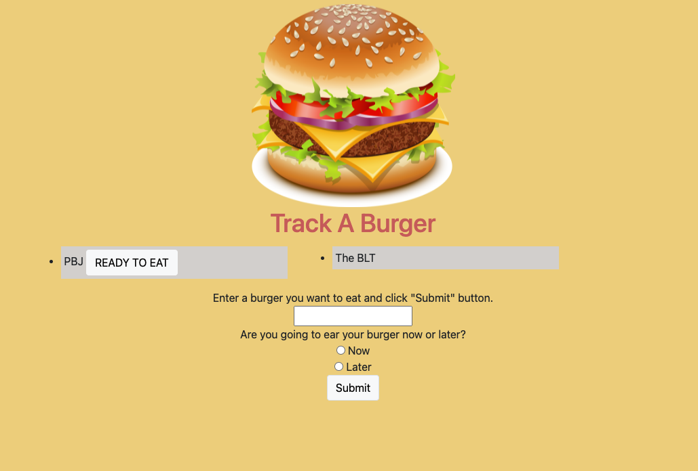

# TrackABurger

  
## Description
This project is a deployed burger tracker. If you are the kind of person that eats more than a single burger this is the app for you. Not only can you track what you have eaten but also what you are going to eat. This application uses Node.JS and Handlebars. While I had some trouble syncing up all of the information my biggest struggle with this application actually came from heroku but in the end I got it working and now it is a deployed tracker. A huge help for making this application was the cats activety from class which I used as a jumping off point. 

  
## Table of Contents 
  
  [Description](##Description)
  
  [Installation](##Installation)
  
  [Usage](##Usage)
  
  [License](##License)
  
  [Tests](##Tests)
  
  [Questions](##Questions)
  
  
## Installation
Since this project is deployed the user only has t go to the site to use it.

Site Link :(https://vast-gorge-52659.herokuapp.com/)

## Usage
To use this app all you have to do is enter the name and info for a burger and then press submit, this will add the burger by name to the correct spot on the page. Once that has been done if you have eaten the burger already it will stay where it is, if the burger is for later then it will show up with an eat me button. 

## Collaborators 
For this project I worked with both my study group and my tutor extensively, they really helped me connect the dots with some of the middle wear in his application and also setting up my heroku.

## License
Copyright (c) 2021 Wendy Tekverk
https://opensource.org/licenses/MIT

## Questions
  GitHub: (https://github.com/wtekverk)
  Email: (wtekverk@gmail.com)
  
